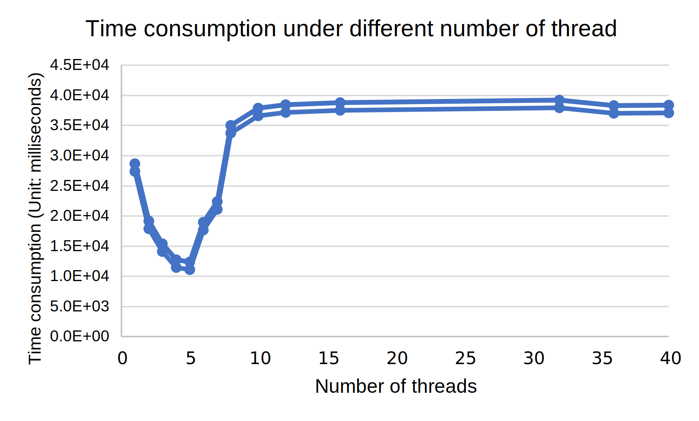

# Project 1: Programming with Multiple Threads

## Overview

Project 1 includes 2 part:
* `generator.cc` will generate the input data for compression experiments.
* `main.cc` provides the function for compression in multi-threads.

`generator.cc` uses random function to produce the characters within the range of ASCII code. It contains 2 parameters:`BLOCK_SIZE` and `NUM_BLOCKS`. User can modify both parameters to obtain different sizes of character files.

`main.cc` calls `ZSTD_compress` to compress, which is a high-performance lossless compression algorithm. To use `ZSTD`, users should install it to system first. 2 parameters are involved in the program, which can be modified: `BLOCK_SIZE` is the size of block that users will compress and `NUM_THREADS` is the number of worker threads.

Project 1 adopts `std::mutex` from C++ STL, and use `std::condition_variable` to ensure the running of program. Condition variable is a synchronization object that typically used to block a thread until a certain condition is met.

## User Guide

### Input data generate

The address of input data could be modified in `generator.cc`. User can modify the generated file size for experiments. Compiling `generator.cc`:
```
g++ generator.cc
```
This will produce an executable file `a.out`. To run `a.out`,
```
./a.out
```
### Compression experiment
Compile main.cc including `zstd` through command
```
g++ -std=c++11 -pthread -o main main.cc -lzstd
```
which produces executable file `main`. To run `main`, two arguments need to be inputted in the teerminal:
```
./main [address of input data] [address of output data]
```
For example, in our case,
```
./main input.data output.data
```
which will compress the data from `input.data` and store in the `output.data`.

By doing experiments, users need to modify `NUM_THREADS` in `main.cc` for each test. Time consumption of each experiment will be printed in the terminal. For example,
```
Time consumption with 1 threads: 28667 milliseconds
```

## Result

We collect the time consumption under different number of threads as following shown. The fastest case is using 5 threads giving out a result of 12371 miliseconds performance. The CPU we used is `Intel(R) Xeon(R) CPU E5-2630 v4 @ 2.20GHz`, which contains `40` cores.


Fig.1 time consumption under different number of thread

## Conclusion
From Fig.1, the trend of time consumption with the increasing of number of threads is declining first then growing to a level-off value.
 

