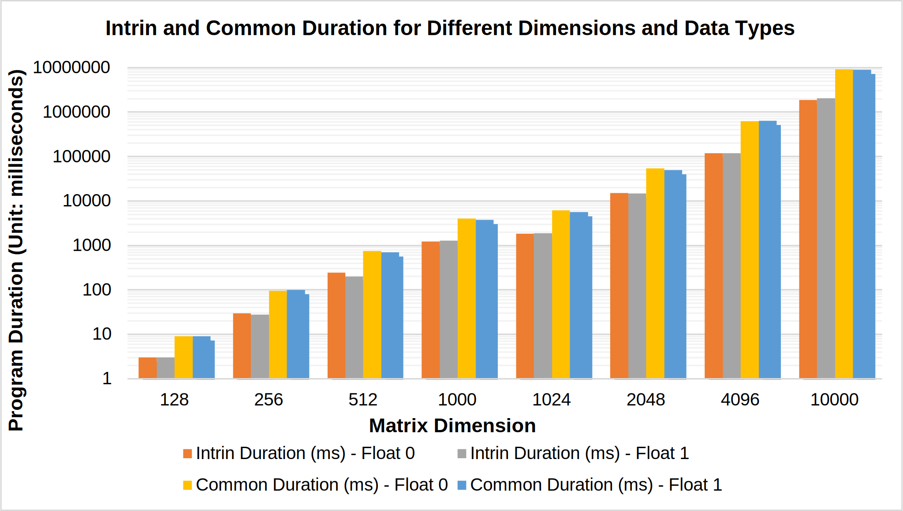

# Project 2: Matrix-Matrix Multiplication with SIMD Instructions & Cache Miss Minimization

## Overview

Project 2 includes 2 programs:
* `gen.cc` is a simple matrix generator written in C++. Given the size of the matrix and the type of values to store (float or fixed point), it generates two matrices (A and B) and stores them in text files.

* `main.cc` implements matrix multiplication for two matrices A and B to get a resultant matrix C. The matrices can either be floating-point numbers or fixed-point numbers.

The matrix multiplication is performed in the function `mulMatrixIntrin`. This function multiplies the matrices A and B to get C. The function uses AVX (Advanced Vector Extensions) instructions from the x86 intrinsic functions to perform 8 floating-point multiplications or 8 integer multiplications in parallel. The function loads 8 values at a time from the matrices into AVX vectors, multiplies them, and adds the results to a running sum. The result is stored in the resulting matrix C.

The code uses AVX instructions from the x86 intrinsic functions to perform efficient matrix multiplication for both floating-point numbers and fixed-point numbers, taking advantage of the SIMD capabilities of modern x86 processors.

## User Guide

### Data Generation
To compile the `gen.cc` program, run the following command:
```
g++ -o gen gen.cc
```
This will generate an executable file named `gen`. To use the `gen` program, execute the following command:
```
./gen <dimension> <isFloat>
```
This will store the two matrices in text files named `matrixA.txt` and `matrixB.txt`. For example, to generate two floating-point matrices with a dimension of `1024`:
```
./gen 1024 1
```

The first line of both `matrixA.txt` and `matrixB.txt` represents the dimension and type of the matrices, respectively.

### Matrix Multiplication

To compile the `main.cc` program, run the following command:
```
g++ -march=native -o main main.cc
```

To execute the program, use the following command:
```
./main matrixA.txt matrixB.txt
```

The program's runtime duration will be displayed in the terminal. For instance:
```bash
Start the Experiment of Dimension: 2048, isFloat: 0
Intrin Duration: 15002 milliseconds
Common Duration: 54236 milliseconds
```

## Experiment

The experiment was conducted on matrices with dimensions `128 256 512 1024 2048 4096 8192` in both floating-point and fixed-point formats. The script `run.sh` can be used to run the experiment easily:

```
sh run.sh
```

The results of the experiment will be displayed in the terminal.

## Result

### Table 1. Performance Comparison of Intrin and Common Duration for Different Dimensions and Data Types


| **Dimension** | **Intrin Duration (ms) - Float 0** | **Intrin Duration (ms) - Float 1** | **Common Duration (ms) - Float 0** | **Common Duration (ms) - Float 1** |
|---------------|------------------------------------|------------------------------------|------------------------------------|-------------------------------------|
| 128           | 3                                  | 3                                  | 9                                  | 9                                   |
| 256           | 30                                 | 28                                 | 95                                 | 99                                  |
| 512           | 246                                | 201                                | 744                                | 699                                 |
| 1024          | 1854                               | 1863                               | 6218                               | 5643                                |
| 2048          | 15002                              | 14925                              | 54236                              | 49576                               |
| 4096          | 119140                             | 118628                             | 618785                             | 637877                              |
| 8192          | 961699                             | 1053853                            | 10618111                           | 10001194                                 |



## Analysis and Conclusion

The results of the experiment show the performance of the matrix multiplication implementation using SIMD instructions and cache miss minimization techniques. The duration of the matrix multiplication is reported for different matrix dimensions and for both floating-point and fixed-point numbers.

It can be observed that the performance improvement using SIMD instructions is significant, especially for larger matrix dimensions. The `Intrin Duration` is significantly lower than the `Common Duration` for matrix dimensions. For example, for a matrix dimension of 4096, the `Intrin Duration` is `119140` milliseconds while the `Common Duration` is `618785` milliseconds.

In terms of the impact of using floating-point numbers vs fixed-point numbers, it can be seen that the duration is similar for both types of numbers. For example, for a matrix dimension of `8192`, the Intrin Duration for floating-point numbers is `1053853`
 milliseconds while for fixed-point numbers it is `961699`
 milliseconds.

 In traditional sequential computing, the CPU processes one instruction at a time for each data element, which can be slow and inefficient. With SIMD instructions, the CPU can perform the same operation on multiple data elements in parallel, greatly reducing the amount of time required to complete the calculation. Additionally, the use of SIMD instructions can also help to minimize cache misses, which can also impact performance.

In conclusion, the use of SIMD instructions and cache miss minimization techniques significantly improves the performance of matrix multiplication. The performance is also similar for both floating-point and fixed-point numbers. However, as the matrix dimension increases, the performance improvement using SIMD instructions becomes even more significant. Overall, the use of SIMD instructions allows for more efficient use of the CPU's resources, resulting in faster and more optimized computation, as seen in the results of the matrix-matrix multiplication experiment.
