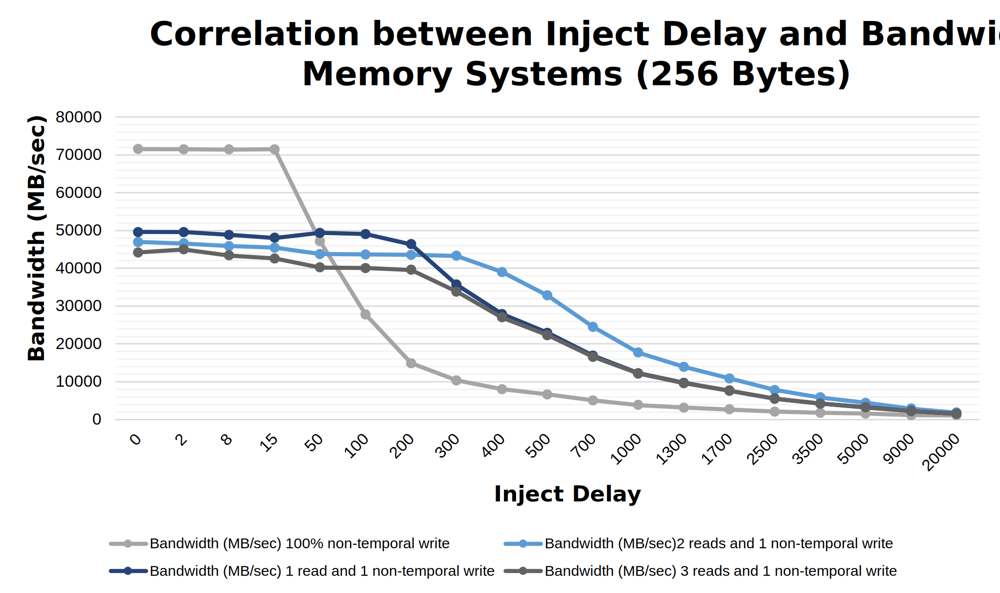

# Memory and Storage Performance Profiling
## Introduction
The purpose of this report is to present the findings and conclusions of a project focused on developing a deeper understanding of the performance of modern memory and storage devices. The project involved conducting comprehensive experiments to measure the read/write latency/throughput of memory and storage devices under various data access workloads.

## How to use
`run.sh` provides the experiments we tested and will automatically partition, mount and umount the disk. Modify the settings:
`SSD_DEVICE="/dev/nvme0n1"`, 
`TEST_PARTITION="/dev/nvme0n1p2"` to user's own SSD device and test partition, this should be seen when running `lsblk` in the command:
```
nvme1n1     259:0    0   1.8T  0 disk 
├─nvme1n1p1 259:3    0   1.4T  0 part /mnt/intelssdp1
└─nvme1n1p2 259:5    0   439G  0 part 
nvme0n1     259:1    0   1.8T  0 disk 
├─nvme0n1p1 259:2    0   1.4T  0 part 
├─nvme0n1p2 259:4    0   423G  0 part /mnt/intelssd1p2
└─nvme0n1p3 259:6    0    16G  0 part [SWAP]
```


 Run following command:

```
sh run.sh
```

## SSD Test Results

CPU: `Intel(R) Xeon(R) CPU E5-2630 v4 @ 2.20GHz`

The SSD for test is `INTEL SSDPEDKE020T7 DC P4600`, with capacity of `2 TB`. 

| Test Type          | Block Size | IOPS  | Bandwidth Read/Write | Latency min (usec) | Latency max (usec) | Latency avg (usec) | Bandwidth avg (KiB/s) | CPU usr | CPU sys | IO Depth  |
|--------------------|------------|-------|----------------------|--------------------|--------------------|--------------------|-----------------------|---------|---------|-----------|
| 100% write         | 4 KiB      | 133k  | 543MB/s (518MiB/s)   | 5                  | 828546             | 116.92             | 599177.8              | 16.12%  | 64.15%  | 16        |
| 100% write         | 32 KiB     | 22.2k | 727MB/s (693MiB/s)   | 24                 | 853052             | 693.74             | 826118.7              | 4.58%   | 70.72%  | 16        |
| 100% write         | 128 KiB    | 5513  | 723MB/s (689MiB/s)   | 148                | 810232             | 2747.13            | 946727.23             | 2.00%   | 70.08%  | 16        |
| 70% read 30% write | 4 KiB      | 134k  | 525 MiB/s (550 MB/s) | 2                  | 895291             | 115.8              | 566794.38             | 17.28%  | 63.16%  | 16        |
| 70% read 30% write | 32 KiB     | 22.3k | 698 MiB/s (731 MB/s) | 24                 | 821068             | 686.34             | 909065.2              | 5.08%   | 70.76%  | 16        |
| 70% read 30% write | 128 KiB    | 5697  | 712MiB/s (747MB/s)   | 72                 | 815279             | 2649.41            | 811571.18             | 2.39%   | 70.30%  | 16        |
| 100% read          | 4 KiB      | 128k  | 500MiB/s (524MB/s)   | 10                 | 851138             | 117.28             | 158843.52             | 16.44%  | 63.53%  | 16        |
| 100% read          | 32 KiB     | 22.1k | 690MiB/s (724MB/s)   | 7                  | 837,672            | 700                | 838,709.11            | 4.28%   | 69.83%  | 16        |
| 100% read          | 128 KiB    | 5610  | 701MiB/s (735MB/s)   | 53                 | 816744             | 2753.63            | 917293.97             | 1.88%   | 70.66%  | 16        |

## Memory Test Results
The experiments are based on `128 GB` memory, with `2600 MHz`.
The results are shown as below:




## Conclusion

### Memory

Based on the results of our experimental study, we have observed that with a fixed stride length of 64B/256B, an increase in injection delay leads to a reduction in latency, while bandwidth decreases as well. Additionally, for the fixed stride length, an increase in the ratio of write operations results in a slight increase in latency and increased bandwidth at small injection delay, while showing similar bandwidth at large injection delay. These observations lead us to conclude that the latency of write operations is higher than that of read operations in memory. Furthermore, we have determined that an increase in stride length from 64B to 256B under the same injection delay and other settings results in an increase in latency and a decrease in bandwidth.

### SSD
Based on the provided data, we can conclude that for each testing scenario, an increase in IO depth leads to an increase in latency and an increase-flat-decrease trend for IOPS. Furthermore, increasing the block size from 4k to 32k for fixed IO depth and number of jobs results in decreased IOPS and increased latency, though the total bandwidth increases due to the larger block size. When comparing read and write operations, write operations generally have lower IOPS and bandwidth, but in most cases have smaller latency than read operations. Additionally, the percentage of reads and writes in a mixed operation does not appear to significantly impact latency, IOPS, or bandwidth.

### Comparasion with `Intel DC P5600`
This experiment is based on `Intel DC P4600`, which is the previous generation product of `P5600`. `P5600` gives 128K Sequential R/W up to 7000/4300 MB/s and Random 4KB R/W up to 1M/260K IOPS.

---

## Appendix Memory Test Original Data
### mlc_test_64-W-6
| Inject | Latency (ns) | Bandwidth (MB/sec) |
|--------|-------------|--------------------|
| 00000  | 185.86      | 71162.7            |
| 00002  | 185.14      | 71158.3            |
| 00008  | 201.66      | 71061.2            |
| 00015  | 187.80      | 71122.5            |
| 00050  | 95.81       | 47125.8            |
| 00100  | 89.60       | 27759.9            |
| 00200  | 82.71       | 14812.7            |
| 00300  | 80.90       | 10260.8            |
| 00400  | 79.79       | 7936.6             |
| 00500  | 78.85       | 6541.1             |
| 00700  | 78.16       | 4919.9             |
| 01000  | 77.45       | 3711.3             |
| 01300  | 77.29       | 3052.4             |
| 01700  | 77.52       | 2530.3             |
| 02500  | 77.15       | 1991.7             |
| 03500  | 76.54       | 1668.2             |
| 05000  | 76.32       | 1420.6             |
| 09000  | 76.48       | 1161.1             |
| 20000  | 76.17       | 986.4              |

### mlc_test_64-W-7

| Inject | Latency (ns) | Bandwidth (MB/sec) |
|--------|-------------|--------------------|
| 00000  | 241.98      | 97352.3            |
| 00002  | 245.82      | 97394.8            |
| 00008  | 242.19      | 98019.6            |
| 00015  | 242.53      | 98523.0            |
| 00050  | 240.91      | 102122.1           |
| 00100  | 231.62      | 101937.3           |
| 00200  | 113.88      | 81454.1            |
| 00300  | 99.82       | 56065.8            |
| 00400  | 93.78       | 42872.1            |
| 00500  | 90.88       | 34724.3            |
| 00700  | 87.98       | 25246.9            |
| 01000  | 85.90       | 18018.9            |
| 01300  | 87.01       | 14065.9            |
| 01700  | 81.36       | 11007.0            |
| 02500  | 80.15       | 7763.7             |
| 03500  | 81.80       | 5762.8             |
| 05000  | 77.84       | 4311.8             |
| 09000  | 77.11       | 2770.5             |
| 20000  | 76.90       | 1706.2             |


### mlc_test_64-W-8

| Inject | Latency (ns) | Bandwidth (MB/sec) |
|--------|-------------|--------------------|
| 00000  | 250.89      | 93757.6            |
| 00002  | 250.99      | 93779.9            |
| 00008  | 250.61      | 94034.9            |
| 00015  | 250.82      | 95161.5            |
| 00050  | 223.84      | 99467.7            |
| 00100  | 142.43      | 94617.3            |
| 00200  | 97.25       | 55624.4            |
| 00300  | 91.56       | 38112.6            |
| 00400  | 88.96       | 29099.7            |
| 00500  | 86.50       | 23579.3            |
| 00700  | 83.45       | 17187.6            |
| 01000  | 81.18       | 12335.9            |
| 01300  | 80.14       | 9702.1             |
| 01700  | 79.17       | 7628.0             |
| 02500  | 78.22       | 5465.2             |
| 03500  | 77.65       | 4146.8             |
| 05000  | 77.07       | 3158.1             |
| 09000  | 76.69       | 2128.8             |
| 20000  | 76.41       | 1420.3             |

### mlc_test_64-W-9

| Inject | Latency (ns) | Bandwidth (MB/sec) |
|--------|-------------|--------------------|
| 00000  | 232.49      | 100268.4           |
| 00002  | 233.67      | 100126.8           |
| 00008  | 232.35      | 101104.1           |
| 00015  | 231.50      | 102212.9           |
| 00050  | 187.76      | 101647.5           |
| 00100  | 132.70      | 94286.4            |
| 00200  | 100.07      | 55266.3            |
| 00300  | 92.14       | 37948.2            |
| 00400  | 88.73       | 29010.8            |
| 00500  | 87.25       | 23516.5            |
| 00700  | 83.97       | 17157.4            |
| 01000  | 81.88       | 12314.9            |
| 01300  | 80.84       | 9686.3             |
| 01700  | 85.71       | 7558.7             |
| 02500  | 78.55       | 5459.7             |
| 03500  | 77.96       | 4142.9             |
| 05000  | 78.18       | 3144.7             |
| 09000  | 76.93       | 2125.9             |
| 20000  | 76.62       | 1418.0             |


### mlc_test_256-W-6

| Inject | Latency (ns) | Bandwidth (MB/sec) |
|--------|-------------|--------------------|
| 00000  | 185.22      | 71549.4            |
| 00002  | 185.79      | 71530.7            |
| 00008  | 201.71      | 71457.8            |
| 00015  | 191.53      | 71498.0            |
| 00050  | 93.66       | 47112.8            |
| 00100  | 85.19       | 27770.9            |
| 00200  | 74.13       | 14898.8            |
| 00300  | 71.80       | 10359.0            |
| 00400  | 69.69       | 8047.6             |
| 00500  | 68.76       | 6658.2             |
| 00700  | 67.83       | 5047.6             |
| 01000  | 67.08       | 3841.7             |
| 01300  | 66.67       | 3186.0             |
| 01700  | 66.30       | 2671.8             |
| 02500  | 66.08       | 2130.7             |
| 03500  | 65.86       | 1803.3             |
| 05000  | 65.70       | 1556.2             |
| 09000  | 75.39       | 1173.1             |
| 20000  | 65.47       | 1123.7             |

### mlc_test_256-W-7

| Inject | Latency (ns) | Bandwidth (MB/sec) |
|--------|-------------|--------------------|
| 00000  | 239.93      | 46944.3            |
| 00002  | 240.32      | 46575.7            |
| 00008  | 238.89      | 45858.1            |
| 00015  | 241.27      | 45496.2            |
| 00050  | 224.04      | 43747.3            |
| 00100  | 218.56      | 43690.7            |
| 00200  | 203.34      | 43587.8            |
| 00300  | 167.48      | 43291.7            |
| 00400  | 126.93      | 39007.7            |
| 00500  | 115.85      | 32821.5            |
| 00700  | 98.81       | 24505.7            |
| 01000  | 87.33       | 17707.9            |
| 01300  | 82.79       | 13943.1            |
| 01700  | 82.37       | 10908.9            |
| 02500  | 74.45       | 7788.1             |
| 03500  | 72.05       | 5854.2             |
| 05000  | 69.70       | 4401.5             |
| 09000  | 67.78       | 2883.2             |
| 20000  | 66.41       | 1837.4             |

### mlc_test_256-W-8

| Inject | Latency (ns) | Bandwidth (MB/sec) |
|--------|-------------|--------------------|
| 00000  | 251.48      | 49604.5            |
| 00002  | 263.88      | 49581.0            |
| 00008  | 250.27      | 48838.3            |
| 00015  | 248.46      | 48065.1            |
| 00050  | 221.90      | 49370.4            |
| 00100  | 201.70      | 49095.7            |
| 00200  | 145.80      | 46367.5            |
| 00300  | 113.98      | 35699.4            |
| 00400  | 107.75      | 27932.5            |
| 00500  | 93.41       | 22952.7            |
| 00700  | 85.09       | 16939.9            |
| 01000  | 79.12       | 12249.1            |
| 01300  | 76.22       | 9684.9             |
| 01700  | 73.59       | 7663.0             |
| 02500  | 71.01       | 5537.0             |
| 03500  | 69.45       | 4242.6             |
| 05000  | 68.17       | 3264.6             |
| 09000  | 66.83       | 2251.3             |
| 20000  | 66.41       | 1546.3             |

### mlc_test_256-W-9

| Inject | Latency | Bandwidth  |
|--------|---------|------------|
| 00000  | 235.36  | 44203.3    |
| 00002  | 237.50  | 44985.8    |
| 00008  | 234.87  | 43408.1    |
| 00015  | 233.89  | 42596.4    |
| 00050  | 217.58  | 40226.1    |
| 00100  | 206.75  | 40058.7    |
| 00200  | 166.11  | 39589.6    |
| 00300  | 123.70  | 33804.8    |
| 00400  | 112.39  | 27006.6    |
| 00500  | 107.57  | 22328.4    |
| 00700  | 95.11   | 16599.3    |
| 01000  | 82.30   | 12118.9    |
| 01300  | 78.57   | 9610.6     |
| 01700  | 75.58   | 7610.7     |
| 02500  | 72.15   | 5512.1     |
| 03500  | 70.47   | 4222.3     |
| 05000  | 72.52   | 3206.6     |
 |09000	 |67.62	   |2240.8|
 |20000	 |66.14	  | 1550.2|
